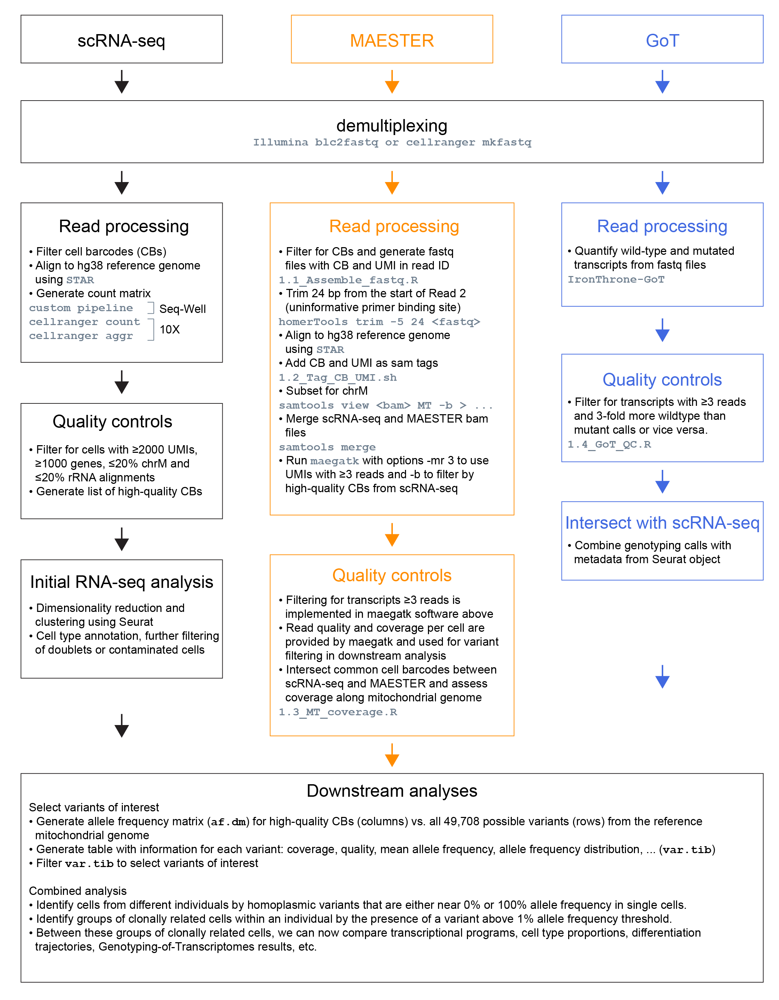

# MAESTER-2021

## Outline
A collection of scripts for the analysis of MAESTER data. This outline (also Supplemental Figure 5 in the paper) shows how scripts are used.

## Pre-processing of sequencing reads and quality controls.

#### 1. Various scripts for read processing
Filter for cell barcodes (CBs) and generate fastq files with CB and unique molecular identifiers (UMIs) from the Read 1 fastq in the read ID of the Read 2 fastq:
[1.1_Assemble_fastq.R](1_Pre-processing/1.1_Assemble_fastq.R)

After alignment, take the bam file and add the CB and UMI from the read ID as bam tags:
[1.2_Tag_CB_UMI.sh](1_Pre-processing/1.2_Tag_CB_UMI.sh)

Take maegatk output and plot coverage along the mitochondrial genome:
[1.3_MT_coverage.R](1_Pre-processing/1.3_MT_coverage.R)

Process IronThrone-GoT summary tables by doing additional QC and generating tables of wild-type/mutant cells:
[1.4_GoT_QC.R](1_Pre-processing/1.4_GoT_QC.R)

## Downstream analyses of combined scRNA-seq, MAESTER and GoT data.

#### 2. Cell line mixing: clustering and cleanup
The same cells, a mixture of K562 and BT142, were analyzed using Seq-Well S^3 and 10X 3' v3 scRNA-seq protocols. These scripts were used to cluster and remove contaminated cells with decontX:\
[2.1_SW_CellLineMix_decontX.R](2_Downstream_analyses/2.1_SW_CellLineMix_decontX.R)\
[2.2_TenX_CellLineMix_decontX.R](2_Downstream_analyses/2.2_TenX_CellLineMix_decontX.R)

#### 3. Cell line mixing: variants
These scripts were used to classify cells as either K562 or BT142 based on mitochondrial variants, and to compare this to classification based on RNA-seq:\
[3.1_SW_CellLineMix_variants.R](2_Downstream_analyses/3.1_SW_CellLineMix_variants.R)\
[3.3_TenX_CellLineMix_variants.R](2_Downstream_analyses/3.3_TenX_CellLineMix_variants.R)

These scripts were used to identify clonal structure in K562 cells of both cell line mixing experiments:\
[3.2_SW_K562_clones.R](2_Downstream_analyses/3.2_SW_K562_clones.R)\
[3.3_TenX_K562_clones.R](2_Downstream_analyses/3.3_TenX_K562_clones.R)

#### 4. Clonal hematopoiesis sample
These scripts were used to analyze cells from the clonal hematopoiesis bone marrow aspirate. This entails UMAP visualization, identification of informative variants, generating a heatmap of variant allele frequencies, and assessing cell type proportions (including the radar plot):\
[4.1_Patient10_UMAP.R](2_Downstream_analyses/4.1_Patient10_UMAP.R)\
[4.2_Variants_Of_Interest.R](2_Downstream_analyses/4.2_Variants_Of_Interest.R)\
[4.3_LineageBias.R](2_Downstream_analyses/4.3_LineageBias.R)

#### 5. Cytotoxic T Lymphocyte correlation
This script was used to correlate the transcriptomes of cytotoxic T lymphocytes (CTLs) within (intraclonal) and between (interclonal) clones that were detected by MAESTER:\
[5.1_CTL_correlation.R](2_Downstream_analyses/5.1_CTL_correlation.R)

#### 6. TET2 mutations
This script was used to quantify transcripts with TET2 mutations, that were detected by Genotyping of Transcriptomes, in clones that were detected by MAESTER:\
[6.1_TET2_heatmap.R](2_Downstream_analyses/6.1_TET2_heatmap.R)

#### 7. Trajectory analysis
This script was used to analyze the myeloid differentiation trajectory including the assignment of pseudotime values and assessment of the density of cells along the trajectory:\
[7.1_Slingshot.R](2_Downstream_analyses/7.1_Slingshot.R)

